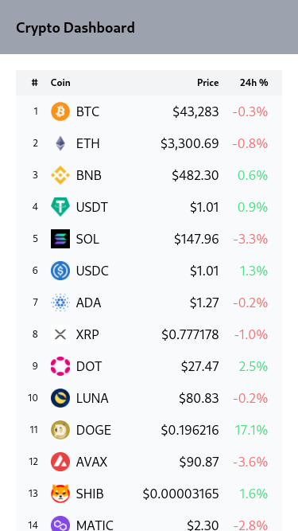

# Crypto Dashboard

The goal of this project is to create an application that displays information about cryptocurrencies.

## Future features

- [ ] Full chart with top cryptocurrencies.
- [ ] Information page for each coin.
- [ ] Personal portfolio and dashboard.

## Build with

- [React](https://reactjs.org/)
- [Tailwind CSS](https://tailwindcss.com/)
- [CoinGecko API](https://www.coingecko.com/en/api)

## Acknowledgments

I plan to make a design similar to the ones on [Uniswap Interface](https://app.uniswap.org/) and [Uniswap Info](https://info.uniswap.org/).
