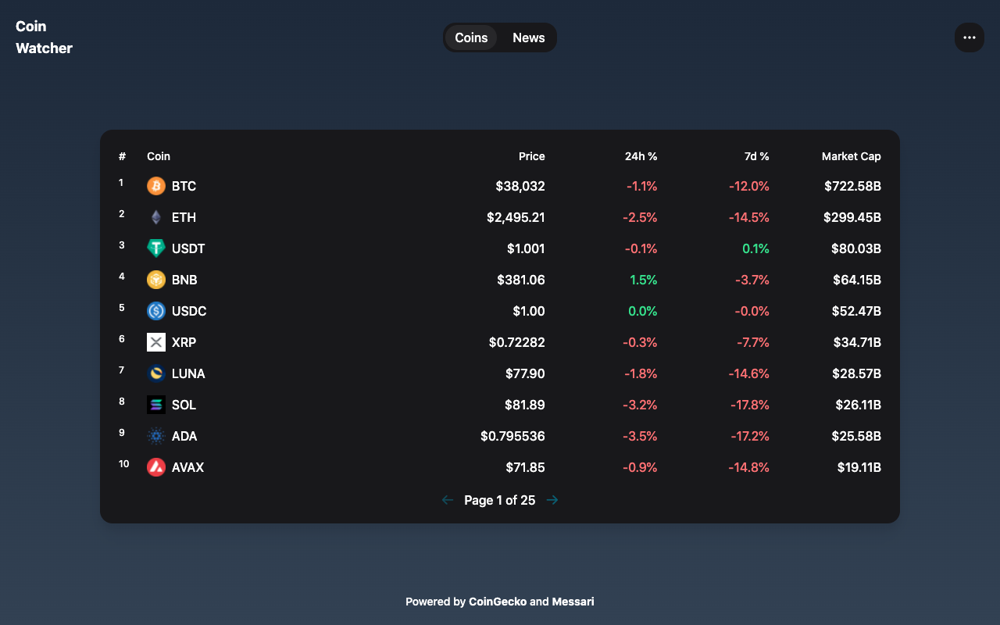

# Coin Watcher

> Web application for consulting crypto prices and news.

## Build with

- [React](https://reactjs.org/)
- [Tailwind CSS](https://tailwindcss.com/)
- [CoinGecko API](https://www.coingecko.com/en/api)
- [Messari API](https://messari.io/api)

## Acknowledgments

The design is inspired by [Uniswap Interface](https://app.uniswap.org/) and [Uniswap Info](https://info.uniswap.org/).

## License

This project is open source and available under the [MIT License](LICENSE).
